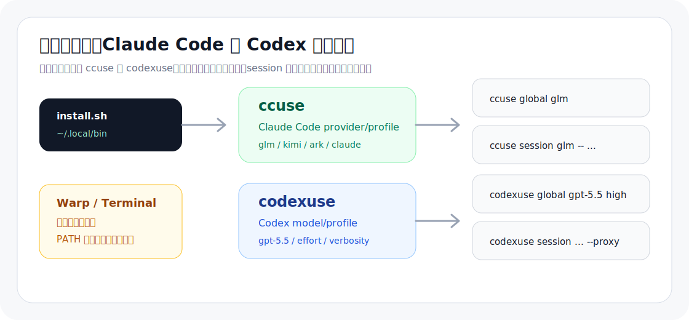
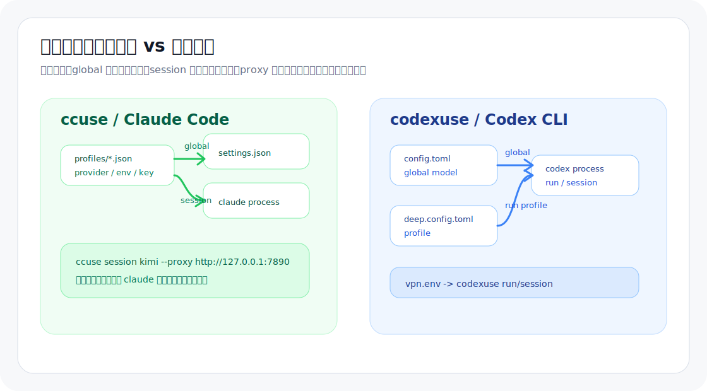

# claudecode-codex-switch

Claude Code 和 Codex CLI 的模型 / provider 切换工具。一个仓库提供两个命令：

- `ccuse`：管理 Claude Code 的 provider profile，支持 Anthropic、Volcengine Ark、Z.AI GLM、Moonshot Kimi。
- `codexuse`：管理 Codex CLI 默认模型和 profile，支持全局默认、单次会话、VPN/proxy。

适合在 Warp、Terminal、iTerm2 等终端里频繁切换 AI coding 模型：日常用低消耗模型，复杂任务临时切到强模型，需要代理时只给当前会话加 proxy。

## 一句话安装

```bash
bash -c "$(curl -fsSL https://raw.githubusercontent.com/kt-aicoding/claudecode-codex-switch/main/scripts/install.sh)"
```

默认安装到 `~/.local/bin/ccuse` 和 `~/.local/bin/codexuse`。如果命令不可用，把下面这行加入 `~/.zshrc`、`~/.bashrc` 或 Warp 启动 shell 的 profile：

```bash
export PATH="$HOME/.local/bin:$PATH"
```

## 复制即用

Claude Code 切到 Z.AI GLM：

```bash
ccuse init-glm
ccuse edit glm
ccuse global glm
```

Claude Code 单次会话使用 GLM 强模型，不改全局配置：

```bash
ccuse session glm -- --model glm-5.2
```

Claude Code 单次会话走 VPN/proxy：

```bash
ccuse session kimi --proxy http://127.0.0.1:7890
```

Codex 默认使用 `gpt-5.5` + high reasoning：

```bash
codexuse global gpt-5.5 high
```

Codex 单次会话使用更高 reasoning，并打开 search：

```bash
codexuse session gpt-5.5 xhigh medium -- --search
```

Codex 持久使用 VPN/proxy：

```bash
codexuse vpn on http://127.0.0.1:7890 "localhost,127.0.0.1"
```

## 快速判断

| 你想做什么 | 用这个 |
| --- | --- |
| 切换 Claude Code 的 API provider / base URL / API key | `ccuse` |
| 临时用某个 Claude Code provider 跑一次，不改全局配置 | `ccuse session <profile>` |
| 切换 Codex 默认模型、reasoning effort、verbosity | `codexuse global <model>` |
| 临时跑一次 Codex，不改 `~/.codex/config.toml` | `codexuse session <model|profile>` |
| 在 Warp 里偶尔需要代理 | `--proxy http://127.0.0.1:7890` |
| 长期让某个 profile / Codex 走代理 | `vpn on` |

## 图示





## ccuse：Claude Code 切换

`ccuse` 通过 profile 文件管理 Claude Code 配置。

| 路径 | 说明 |
| --- | --- |
| `~/.claude/profiles/` | profile 目录 |
| `~/.claude/settings.json` | Claude Code 当前全局配置 |
| `~/.claude/settings.json.bak` | 全局切换前自动备份 |

### 初始化 profile

```bash
ccuse init-claude
ccuse init-ark
ccuse init-glm
ccuse init-kimi
```

`init-*` 会生成带占位 API key 的 profile。首次使用后运行：

```bash
ccuse edit glm
```

把 `YOUR_*_API_KEY` 替换为自己的 key。真实 key 只保存在本机，不会提交到仓库。

### 全局切换

全局切换会把 profile 写入 `~/.claude/settings.json`，适合接下来一段时间都用同一个 provider：

```bash
ccuse global glm
ccuse global kimi
ccuse global ark
ccuse global claude
```

这些短命令等价于 `ccuse global <name>`：

```bash
ccuse glm
ccuse kimi
ccuse ark
ccuse claude
```

### 单次会话

单次会话只把 profile 里的 `env` 注入本次 `claude` 进程，不修改 `settings.json`：

```bash
ccuse session glm
ccuse session glm -- --model glm-5.2
ccuse session kimi --proxy http://127.0.0.1:7890
```

`--` 后面的参数会原样传给 `claude`。

### VPN/proxy

只给当前会话加代理：

```bash
ccuse session ark --proxy http://127.0.0.1:7890
```

把代理持久写进某个 Claude Code profile：

```bash
ccuse vpn glm on http://127.0.0.1:7890 "localhost,127.0.0.1"
ccuse vpn glm show
ccuse vpn glm off
```

### 常用命令

```bash
ccuse list
ccuse show
ccuse models
ccuse edit glm
ccuse remove glm
```

内置 provider 模板：

| 命令 | Provider | 说明 |
| --- | --- | --- |
| `ccuse claude` | Anthropic | 使用原生 Claude 配置 |
| `ccuse ark` | Volcengine Ark | Ark Coding Plan Claude 兼容接口 |
| `ccuse glm` | Z.AI GLM | GLM Coding Plan / Anthropic 兼容接口 |
| `ccuse kimi` | Moonshot Kimi | Kimi Code Anthropic 兼容接口，默认 `kimi-for-coding` |

## codexuse：Codex 切换

Codex CLI 本身支持多种模型切换方式：

- 临时启动：`codex --model <model>`
- 会话内切换：在 Codex 交互界面使用 `/model`
- 持久默认：写入 `~/.codex/config.toml`
- Profile 启动：运行 `codex --profile <name>`

`codexuse` 把这些封装成全局默认、profile 和单次会话。

| 路径 | 说明 |
| --- | --- |
| `~/.codex/config.toml` | Codex 当前全局配置 |
| `~/.codex/<name>.config.toml` | Codex profile |
| `~/.codex/vpn.env` | `codexuse run/session` 使用的持久 proxy 环境 |

### 全局默认

```bash
codexuse global gpt-5.5 high
codexuse global gpt-5.5 xhigh medium
```

也可以使用别名：

```bash
codexuse set gpt-5.5 high
codexuse gpt-5.5 high
```

写入效果：

```toml
model = "gpt-5.5"
model_reasoning_effort = "xhigh"
model_verbosity = "medium"
```

### Profile

创建 profile：

```bash
codexuse init-fast
codexuse init-deep
codexuse init fast gpt-5.5 medium low
codexuse init deep gpt-5.5 xhigh medium
```

运行或应用 profile：

```bash
codexuse run fast
codexuse run deep -- --search
codexuse use deep
codexuse deep
```

`codexuse use <profile>` 只把 profile 里的模型相关顶层字段合并到 `config.toml`，不会覆盖 MCP、sandbox、trust list 等其他配置。

### 单次会话

```bash
codexuse session gpt-5.5 high
codexuse session gpt-5.5 xhigh medium -- --search
codexuse session fast -- --search
```

### VPN/proxy

只给当前 Codex 会话加代理：

```bash
codexuse session gpt-5.5 high --proxy http://127.0.0.1:7890
codexuse run fast --proxy http://127.0.0.1:7890 -- --search
```

持久保存代理，供后续 `codexuse run/session` 自动使用：

```bash
codexuse vpn on http://127.0.0.1:7890 "localhost,127.0.0.1"
codexuse vpn show
codexuse vpn off
```

### 常用命令

```bash
codexuse list
codexuse show
codexuse models
codexuse edit config
codexuse edit fast
codexuse remove fast
```

## 当前模型速查

更新日期：2026-06-27。模型 ID 会变，自动化前以 provider 控制台和官方文档为准。

| Provider | 推荐 / 常用模型 |
| --- | --- |
| Claude Code native | `opus`、`sonnet`、`fable`；Claude API 示例：`claude-opus-4-8`、`claude-sonnet-4-6`、`claude-haiku-4-5` |
| Volcengine Ark Coding Plan | `ark-code-latest`、`doubao-seed-2-0-pro-260215`、`doubao-seed-2-0-code-preview-260215`、`doubao-seed-2-0-mini-260215`、`doubao-seed-2-0-lite-260215` |
| Z.AI GLM Coding Plan | `glm-5.2`、`glm-5.2[1m]`、`glm-5-turbo`、`glm-4.7` |
| Moonshot Kimi Code | `kimi-for-coding`；Thinking 模式会调用最新 K2.7 Code，否则走 K2.6 |
| Codex / OpenAI | `gpt-5.5`，`o3` 仍是 Codex config override 示例中的模型 ID |

查看 CLI 内置清单：

```bash
ccuse models
codexuse models
```

完整说明见 [docs/models.md](docs/models.md)。

## Warp 使用建议

Warp 不需要额外集成。把安装目录加入启动 shell 的 `PATH` 后，在 Warp 里直接运行 `ccuse` / `codexuse` 即可。

常见用法：

```bash
# 日常默认
ccuse global glm
codexuse global gpt-5.5 high

# 本次任务临时更强
ccuse session glm -- --model glm-5.2
codexuse session gpt-5.5 xhigh medium

# 本次任务临时走代理
ccuse session kimi --proxy http://127.0.0.1:7890
codexuse session gpt-5.5 high --proxy http://127.0.0.1:7890
```

## 安全边界

- 安装脚本只下载 `bin/ccuse` 和 `bin/codexuse` 到本机。
- 写入配置前会备份已有文件，默认备份后缀是 `.bak`。
- 仓库不提交 API key、OAuth token、项目 trust list 或个人路径配置。
- `ccuse session` 和 `codexuse session` 不修改全局配置，适合临时试模型。
- `codexuse use <profile>` 只合并模型相关顶层字段，不覆盖整份 `config.toml`。

## 排错

命令找不到：

```bash
export PATH="$HOME/.local/bin:$PATH"
which ccuse
which codexuse
```

查看当前配置：

```bash
ccuse show
codexuse show
```

查看 profile：

```bash
ccuse list
codexuse list
```

重新编辑 API key：

```bash
ccuse edit glm
ccuse edit kimi
```

## 本地开发

```bash
bash -n bin/ccuse bin/codexuse scripts/install.sh tests/smoke.sh
bash tests/smoke.sh
scripts/export-readme-images.sh
```

## 资料

- [Codex 模型切换调研](docs/codex-model-switching.md)
- [ccuse 实现说明](docs/ccuse-notes.md)
- [模型清单与示例](docs/models.md)
- [生图与 README 配图工具调研](docs/image-tools.md)
